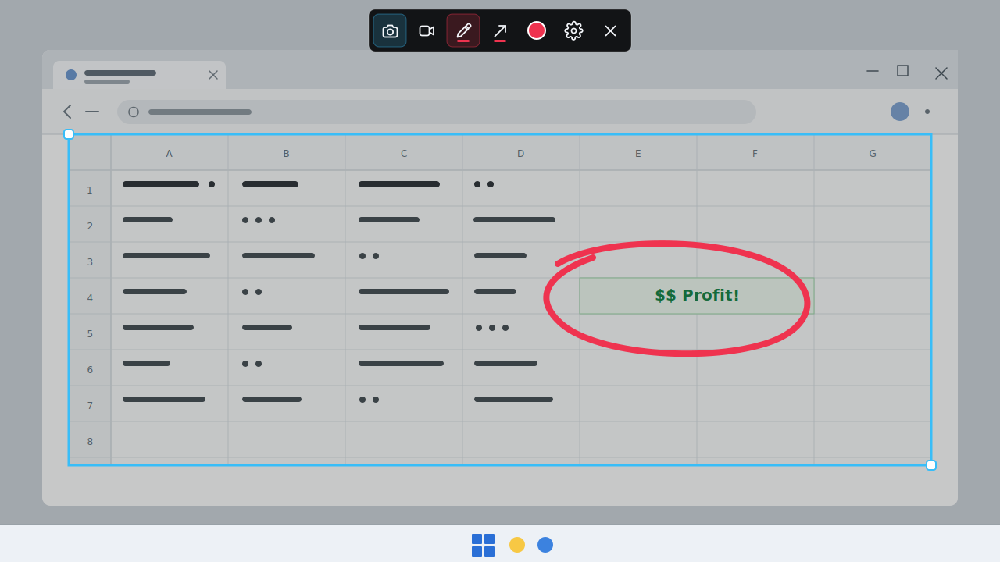

# Softshot

Softshot is a lightweight Windows screenshot and screen recording tool built for the moments when the default tools feel too slow, too crowded, or too detached from the thing you are trying to share.

Hit a shortcut, drag the exact region you want, mark it up, and save or copy it without falling into a full editing suite.

<p align="center">
  
</p>

## Why Softshot

- Fast capture flow: press `PrintScreen`, select an area, and save with `Enter` or copy with `Ctrl+C`.
- Built-in markup: add quick pen strokes and arrows before you save the shot.
- Cursor-free region recording: switch the same selection into video mode, then record just that part of the screen.
- Simple quality controls: choose `720p` or `1080p` and `30fps` or `60fps`.
- Trim before sharing: recordings open in a focused editor so you can keep only the useful part.
- Local-first sharing: no account, cloud workspace, or project library between the capture and your clipboard.
- Tray-first desktop app: Softshot stays out of the way until you need it.

## Screenshots

### Capture and annotate

<p align="center">
  
</p>

### Record and trim

<p align="center">
  
</p>

## How It Works

1. Start Softshot.
2. Press `PrintScreen` to open the capture overlay.
3. Drag over the region you want to capture.
4. Save the screenshot, copy it, or switch to video mode.
5. When a recording finishes, trim it in the editor and save or copy the result.

If Windows or another app has already taken `PrintScreen`, Softshot falls back to `Ctrl+Shift+PrintScreen` or `Ctrl+Alt+S` and explains what happened.

## Install From Source

Softshot is currently Windows-focused and expects Node.js 24.x with npm available on your PATH. Clone the repository, then run:

```powershell
cd Softshot
npm install
npm run dev
```

## Build An Installer

```powershell
npm run package
```

The packaged Windows installer is written to `release/`.

## Development

```powershell
npm run build
npm run lint
```

## Project Status

Softshot is early, practical, and intentionally small. The current app is focused on Windows desktop capture, region screenshots, cursor-free GPU recording, and quick trimming before sharing.
